# vue-test

## Описание

Приложение позволяет конфигурировать формы (адаптивные под разные устройства), а затем использовать их.  
В приложении существуют несколько разделов:
1. Создание форм  
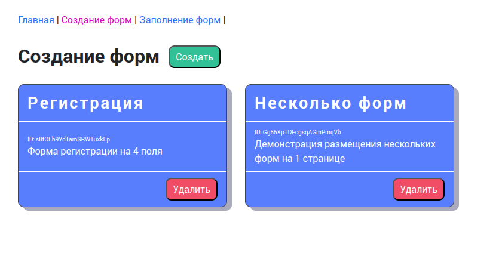
2. Заполнение форм  
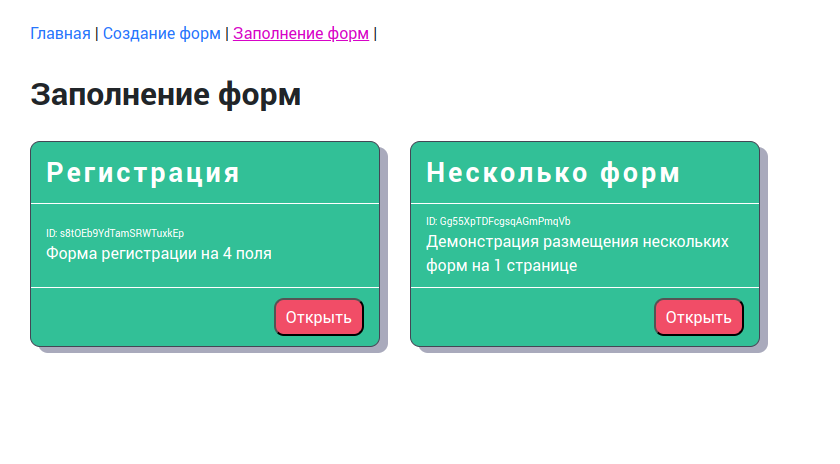  
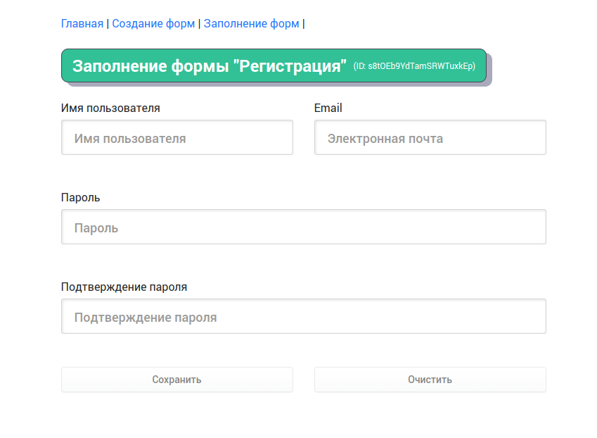  
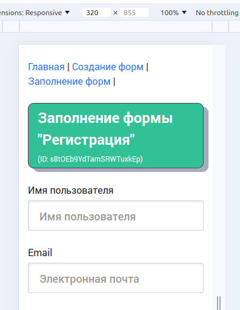  

Основной функционал реализован в разделе "Создание форм", более подробно о его возможностях читайте ниже.

## Возможности конфигуратора

1. Конфигурировать сетку формы без ограничений (уровень вложенности не ограничен)  
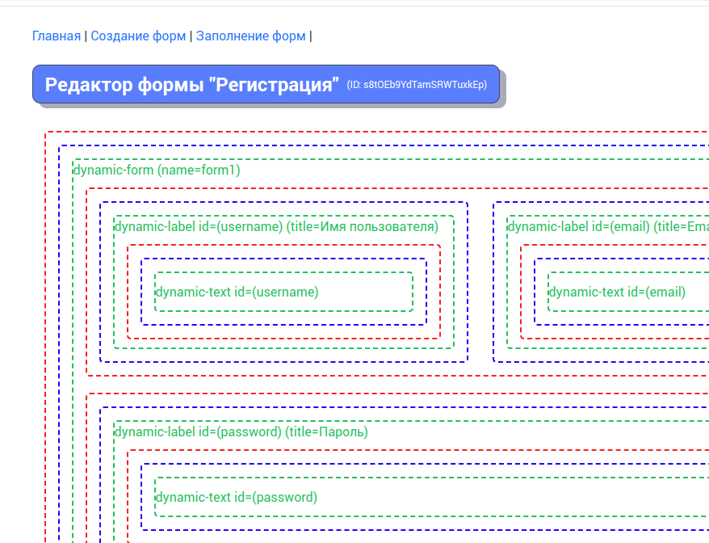  
2. Конфигурация осуществляется через popup меню  
   3. Меню компонента   
   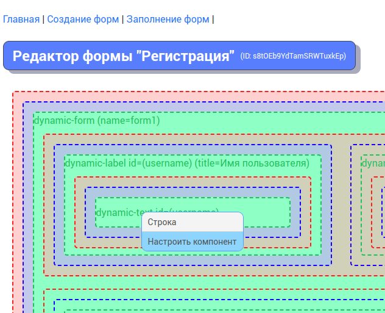  
   4. Меню колонки  
   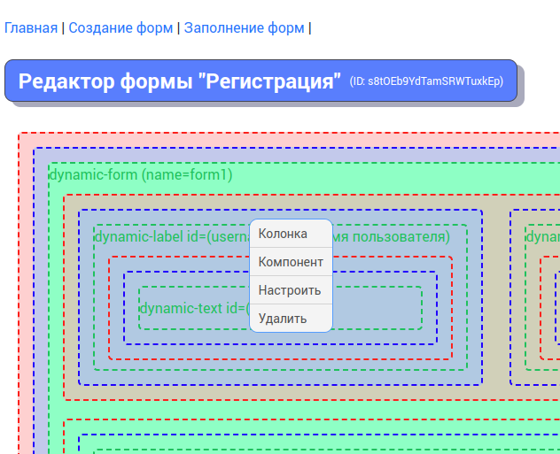  
   5. Не инициализированная колонка  
   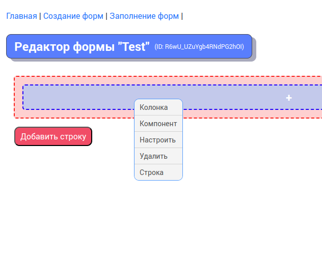  
3. Настройка колонки   
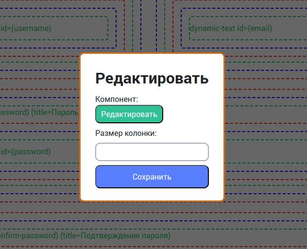  
4. Настройка компонента  
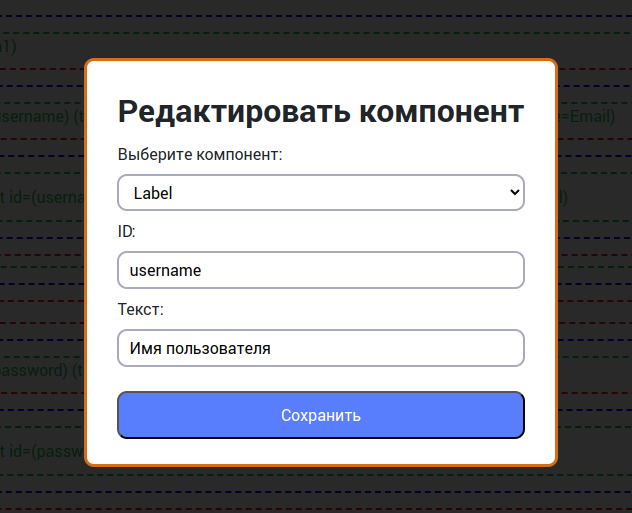  
5. Для выбора доступно 5 компонентов  
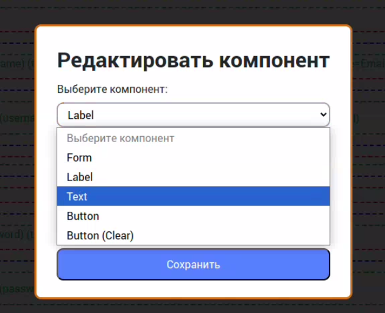  
6. В компоненты Form, Label можно вкладывать другие компоненты  
7. На форме может располагаться несколько независимых форм [Демонстрация работы на видео](public/img/a1.mp4)  
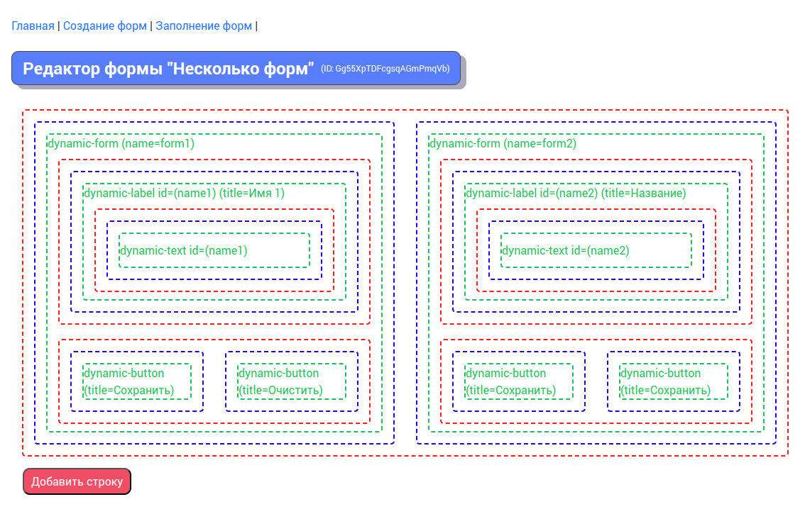  


## Project setup
```
npm install
```

### Compiles and hot-reloads for development
```
npm run serve
```

### Compiles and minifies for production
```
npm run build
```

### Run your unit tests
```
npm run test:unit
```

### Run your end-to-end tests
```
npm run test:e2e
```

### Lints and fixes files
```
npm run lint
```

### Customize configuration
See [Configuration Reference](https://cli.vuejs.org/config/).
